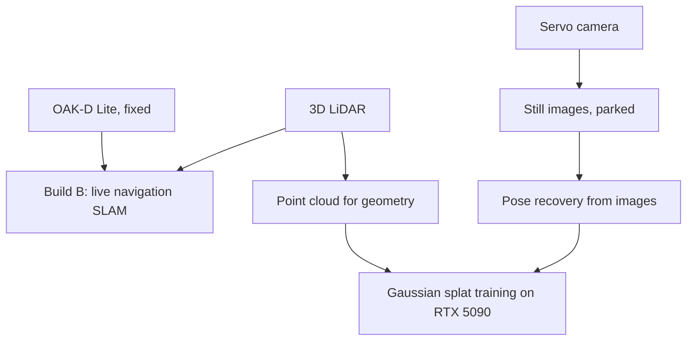

# 00 MASTER: Beast Vision and Capture

Last updated: 2026-07-28
Supersedes the earlier vision doc set (00 master / 01 video pipeline / 02 camera candidates / 03 unscoped thermal+zoom). The video pipeline doc still stands on its own; the camera-candidates doc is superseded by `02-camera-decision.md` here.

## Doc set

| Doc | Covers |
|---|---|
| `01-splatting-architecture.md` | **The key ruling.** Which reconstruction architecture Build A uses, and what it does and does not require of the camera |
| `02-camera-decision.md` | The servo-head camera ruling, candidate, open flags |
| `03-rejected-paths.md` | Every path explored and killed, with the reason. Read before re-proposing anything |
| `04-lidar-open-decision.md` | Livox Mid-360S vs RoboSense Airy 96, still open |
| `05-research-method.md` | How the research went wrong, and where the real communities are |

## Current state in one table

| Question | Status | Where |
|---|---|---|
| Reconstruction architecture | **Ruled: images carry poses, LiDAR supplies geometry** | 01 |
| Servo-head camera | **Ruled: Arducam B0497 IMX678, $159.99**, pending flags | 02 |
| Fixed camera slot | Already filled by owned OAK-D Lite | 02 |
| Capture method | Stop-and-shoot, rover parked | 01 |
| Time synchronization | **Not required.** Falls out of parked capture | 01 |
| Camera-to-LiDAR extrinsic | Not load-bearing under the ruled architecture | 01 |
| LiDAR model | Open | 04 |
| Thermal, zoom, PTZ, FPV | All killed | 03 |

## Two missions, kept separate

Build A is offline. Nothing about it needs to run in real time, and that fact removes most of the hardware requirements that dominated earlier drafts.

## Reading order for a new agent

1. `01-splatting-architecture.md` first. Everything else follows from it.
2. `03-rejected-paths.md` second, to avoid re-opening closed questions.
3. `05-research-method.md` before doing any new research on this topic.
