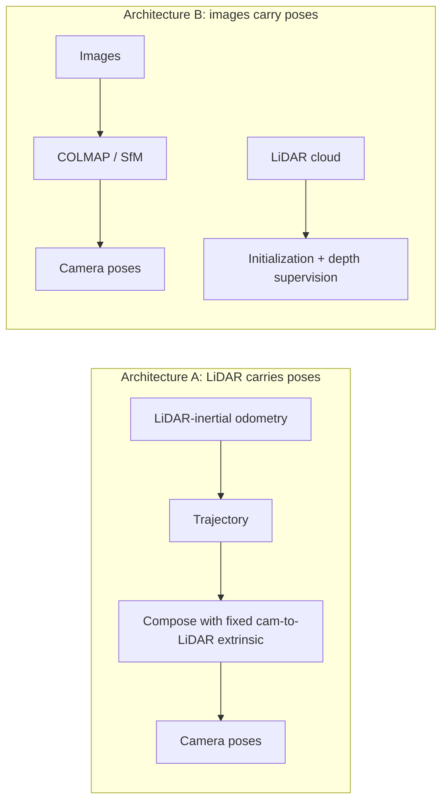

# 01: Splatting Architecture Ruling

Status: **RULED**, 2026-07-28, verified against primary sources.
This is the doc that governs the rest. Several earlier recommendations were wrong because this question was never asked.

## The two architectures

| | Architecture A | Architecture B |
|---|---|---|
| Pose source | LiDAR-inertial odometry | The images themselves |
| LiDAR role | Master timing and pose reference | Geometry: dense init and depth supervision |
| Examples | Gaussian-LIC, Gaussian-LIC2, FAST-LIVO2 | DN-Splatter, splatfacto, lidar-gsplat |
| Needs rigid cam-to-LiDAR mount | **Yes, critically** | No |
| Needs sub-ms time sync | **Yes** | No |
| Needs hardware trigger | Often | No |
| Real-time capable | Yes, that is its point | No, offline |

## The ruling: Architecture B

Build A is offline. Real-time capability buys nothing. Architecture A's entire cost structure exists to serve a requirement Build A does not have.

## Why this is the right read (sourcing)

Three independent primary sources, checked 2026-07-28:

- **The DN-Splatter paper** (Turkulainen et al., WACV 2025) describes COLMAP SfM initialization alongside sensor depth initialization, and in its own implementation details states it uses the iPhone sequences **with COLMAP registered poses**. The reference implementation of depth-supervised splatting takes poses from images and uses the depth sensor only for supervision.
- **theLodgeBots/lidar-gsplat** is this architecture in three scripts: `prepare_colmap_with_depth.py` (COLMAP format plus depth maps), `lidar_to_pointcloud.py` (dense init from LiDAR back-projection), `train_with_depth.py` (depth-supervised trainer).
- **Course material for this exact task** states the original 3DGS work used RGB-only with COLMAP poses, and that dropping the LiDAR costs you depth supervision and falls back to COLMAP's sparse cloud instead of dense LiDAR points. The LiDAR is enrichment, not the pose source.

Supporting: depth supervision from LiDAR or SfM point clouds is a well-established line going back to DS-NeRF (2021), where models converge faster, reach higher final quality, and need fewer training views.

## The finding that settles it

A paper evaluating alternatives to SfM point cloud initialization tested COLMAP-free training using ORB-SLAM3 poses. It ran significantly faster than the COLMAP pipeline but produced **lower PSNR, which the authors attribute to less accurate pose estimation**.

SLAM-derived poses appear to be *worse* for splat quality than poses recovered from the images. Architecture A is the real-time path, not the premium path. Treating it as premium was the root error in earlier drafts.

## What this rules out as a requirement

Each of these was treated as load-bearing in earlier drafts. Under Architecture B, none are:

| Requirement | Why it dissolves |
|---|---|
| Rigid co-mounting of camera and LiDAR on one plate | COLMAP does not care how the camera got where it was |
| Sub-millisecond LiDAR-camera time sync | Only matters if LiDAR timing defines camera pose |
| Hardware trigger wire from LiDAR to camera | Same |
| MCU emulating a GNSS receiver to fake a shared clock | Same |
| Global shutter | Needed when a moving platform's rolling readout corrupts geometry. Parked capture removes the motion |
| Machine-vision camera class with trigger input | Follows from the above |
| Precise camera-to-LiDAR extrinsic calibration | Register the cloud to the finished reconstruction afterward instead |

**The servo mount is therefore fine, and probably an advantage:** more viewpoints per stop without moving the rover.

## Capture method: stop-and-shoot

Park the rover. Drive the servo to a position. Shoot. Repeat.

This is the single decision that removes the most complexity:

- No motion means no motion blur
- No motion means rolling shutter is harmless
- No motion means timing between sensors is irrelevant
- Parked, you can use long exposures, so low-light sensitivity stops being critical

Sanity check from the literature: 3DGS normally wants steady, high-quality photographs, and there is a whole published method (Seiskari et al., Spectacular AI) for compensating the motion blur and rolling shutter that handheld capture introduces. Parking sidesteps the problem the paper exists to solve.

## Resolution ceiling

Nerfstudio's splatfacto downscales by default so the maximum image dimension is under 1600px. Published benchmarks downsample further for VRAM reasons; the FIORD dataset team downsampled 4x to 800x800 because full resolution exceeded RAM on a 24GB RTX 4090.

Practical target is roughly **4K / 8MP**, not more. Beyond that the trainer discards the pixels and you buy VRAM problems.

Confidence: medium. The 1600px figure is a **default**, not a hard ceiling, and can be overridden. The 5090 has more headroom than the 4090 in the benchmark. Treat 4K as "sufficient, do not chase more," not as a proven optimum.

## Radiometric discipline (the part that does still matter)

Splatting assumes a surface looks the same colour from every viewpoint. Two things break that:

**Auto exposure and auto white balance.** Frame-to-frame brightness and colour shifts cause the optimizer to invent semi-transparent Gaussians in front of surfaces, producing cloudy artifacts. Lock exposure and white balance manually. The chosen camera exposes both as manual UVC controls.

**Onboard lighting.** A light mounted to the rover moves with the camera, so the same wall is lit from a different angle in every shot. That bakes view-dependent shading into what should be view-independent appearance. Fixed lights placed in the space, or sufficient ambient light, work. A lamp on the robot does not.

Note the earlier advice to shoot at f/8 to f/11 came from a weak source and does not apply: the chosen module has a fixed aperture and cannot be stopped down.
