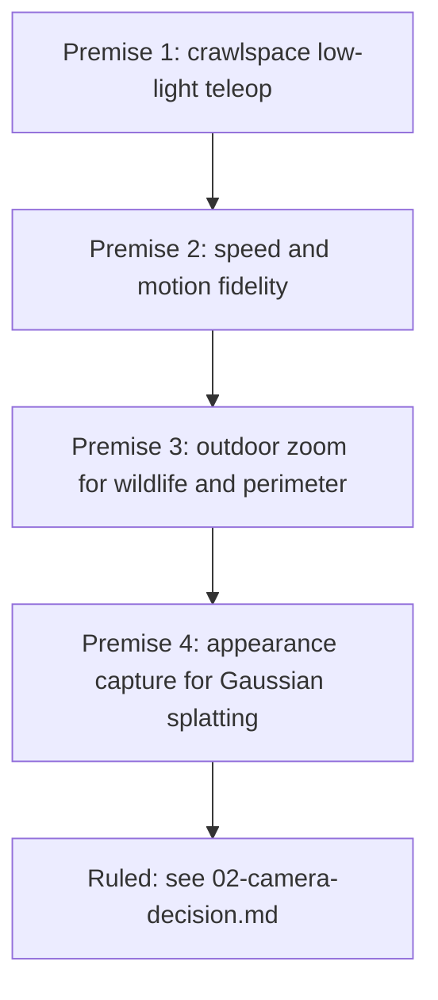

# 03: Rejected Paths

Read this before proposing any camera or sensor for the Beast. Every entry below was explored and killed. The premise for the servo camera changed **four times** during exploration, so the reasoning matters more than the verdicts.

## Premise history

Each shift invalidated the prior recommendation. If a new premise appears, expect the same.

## Killed: hardware

| Path | Killed because |
|---|---|
| **DJI O3 / Walksnail FPV chain** | Air units output only to proprietary goggles or receivers; cannot feed a Quest 3 directly. Routing via HDMI to PC to Virtual Desktop reintroduces the latency it was meant to remove. $150 to $300+ for the air unit alone |
| **Insta360 X5** | Recommended by another agent for 360° appearance capture. Not a UVC device; webcam mode caps at 2880x1440/30fps; standalone body with own battery and microSD; makes the pan-tilt pointless; runs hot in 360 mode, which is bad in a sealed crawlspace; $549.99. Its actual pitch (Splatica-style, 360 capture replacing LiDAR) competes with the LiDAR-fused pipeline rather than complementing it |
| **IP PTZ security cameras** (SV3C, Avalonix, UniFi G6) | Correct capability set for wildlife and perimeter, wrong physical scale entirely. A security PTZ is roughly grapefruit-sized; the Beast head is sized for a 38x38mm board. Also 12V or PoE power on an 11.1V nominal rail with brownout history |
| **FLIR Lepton thermal** | Lepton XDS ($239, thermal plus co-registered 5MP visible, the best value by a clear margin) sold out at GroupGets and unavailable elsewhere. Remaining path is Lepton 3.5 ($164 GroupGets / $172 Digi-Key) plus a PureThermal carrier ($110 to $125), roughly $279 for thermal alone. The cheap non-radiometric 500-0771-FS1 is volume-only: zero stock, 100-piece minimum. Also 8.7fps, an export-classification design choice |
| **InfiRay Tiny1-C / P2 Pro** | Genuinely better than Lepton on the specs that matter: 256x192 vs 160x120, 25Hz vs 8.7Hz, 0.22°/px vs 0.36°/px angular resolution, USB-C native, 9g, ~$268 to $279. Not pursued once thermal itself was dropped. **Revisit this first if thermal ever returns** |
| **Motorized optical zoom modules** | Cheap "10x zoom" USB modules are manual varifocal: you twist the barrel by hand, useless on a deployed rover. Motorized UVC-controllable options exist (e-con See3CAM_30Z10X, IMX179 blocks) but zoom was dropped on principle, below |
| **Manual varifocal 5-50mm** | Same: set-once-in-the-garage focal length |
| **Machine-vision cameras** (LUCID Triton TRI050S-C, FLIR Blackfly S) | Correct under Architecture A. Unnecessary under the ruled Architecture B. See `01` |

## Killed: concepts

**Zoom as an organizing goal.** Three stacking reasons:
1. Small package plus long focal length means a tiny entrance pupil, so the image is darkest exactly when zoomed. Both target missions were low-light missions.
2. 10x magnifies angular jitter 10x. Hobby bus servos have backlash; the chassis settles after stopping.
3. **The rover already is the zoom.** Mobility and focal length buy the same thing. Paying for zoom to avoid driving closer pays twice for one capability, in the currency this platform is poorest in.

**Thermal as the wildlife and perimeter answer.** Sound reasoning, killed on availability. Range was not the problem: the Lepton 3.5 at 0.36°/px puts roughly 5 pixels on a deer at 50m, which is comfortable detection, marginal to 100m. The real caveat is that thermal contrast collapses when ambient approaches body temperature, so Tennessee summers are the worst case.

**Perimeter monitoring as a rover mission.** A fixed pole camera beats a rover on perimeter: always on, mains powered, permanently positioned. The rover's genuine advantage is investigating what a fixed sensor detected, and reaching places with no coverage.

## Known chassis constraints

- The Beast is **explicitly not waterproof**. This limits outdoor missions more than any camera choice does, and makes an IP-rated camera housing pointless over an open chassis.
- Documented **USB brownout** on the Beast power rail, from the OAK-D Lite evaluation. Check power budget before adding USB devices.
- Max speed 0.35 m/s.
- Pan-tilt supports IMU-based vertical stabilization, tuned for driving rather than precision pointing.
