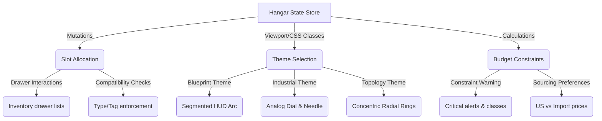

# The Hangar: Test Suite Audit & Agentic Quality Assurance Plan

---
**Audit Date:** 2026-06-17  
**Auditor:** Expert Test Auditor Agent  
**Current Test Coverage:** 0% (0 Files)  
**Overall Grade:** **F**  
---

## Executive Summary

An audit of the repository has confirmed a **complete absence of test files** in the codebase. There are currently:
- **0** Unit Tests
- **0** Integration Tests
- **0** End-to-End (E2E) Tests

While the application features a beautifully polished "Dark Engineering HUD" design built on a modern stack (Next.js 16, React 19, Tailwind CSS 4, and Framer Motion), it functions entirely without programmatic safeguards. 

### Key Risks
1. **Regressions in Store Logic:** Custom state updates like loadout slots, theme swaps, and currency toggles are handled via client-side context hooks. Structural modifications risk breaking key interactions silently.
2. **Brittle Visual Layouts:** The UI relies on three drastically different interactive rendering states (`blueprint`, `industrial`, and `topology`). Changes in styling variables or layout containers could render portions of the HUD unusable on target viewports.
3. **Budget Computation Errors:** Dynamic constraints (calculating currency, power consumption, and weight limits) are vital for mission planning. Arithmetic errors or incorrect fallback logic in sourcing could misrepresent asset status.

---

## Gap Analysis: Core Functional Areas

The following critical flows lack any automated validation:



### 1. State Store Updates (`src/lib/store.tsx` & `src/components/HangarProvider.tsx`)
*   **The Gap:** The store handles reactive updates like `updateSlot`, global preferences (`theme`, `source`, `lensMissionId`), and workbench state.
*   **Consequences of Failure:** Modifying slot logic could cause units to disappear from inventory, enable double-allocation of physical assets, or corrupt local storage state, breaking layout persistency.

### 2. Slot Compatibility (`src/components/InventoryDrawer.tsx`)
*   **The Gap:** The application implements dynamic filtering rules (`checkCompatibility`) matching target slot keyword requirements (e.g., "compute", "power", "sensor") to unit capabilities, class names, and tags.
*   **Consequences of Failure:** Users could mount invalid units into specialized chassis interfaces (e.g., socketing a battery unit into a camera rail), breaking the physical base-builder upgrade logic.

### 3. Theme Layout Changes (`src/app/layout.tsx` & component branches)
*   **The Gap:** The HUD renders in three modes, swapping out core components (e.g., rendering table-based ledgers in Industrial mode vs. command-terminal offsets in Blueprint mode).
*   **Consequences of Failure:** Class name refactoring or Tailwind 4 config modifications could disrupt theme-specific classes, causing interactive controls to hide or overlap, compromising the desktop command-center experience.

### 4. Budget Overload Rules (`src/lib/store.tsx` - `useCalculatedConstraints`)
*   **The Gap:** Dynamic calculations aggregate mission constraints. Exceeding limits triggers warnings, warning status indicators (`[SYS_OVR]`), and custom animations (concentric pulsing rings or hazard patterns).
*   **Consequences of Failure:** Missing or incorrectly formatted calculations would allow mission configurations that exceed power limits or structural budgets to show as valid, violating the constraint checking contract.

---

## The Agentic Testing Paradigm

To protect a highly interactive, stateful web interface like The Hangar, we must move beyond traditional testing scripts and adopt **Goal-Oriented Agentic Testing**.

### What is Goal-Oriented Agentic Testing?
Traditional E2E scripts (like basic Playwright or Selenium scripts) are highly brittle. They rely on hardcoded selectors (e.g., `.grid > div:nth-child(3) > button`) and linear interaction paths (e.g., click button A, wait 200ms, assert text B). If a developer changes a layout style, adds a wrapper, or adjusts animation timing, the test script breaks even if the user functionality remains perfectly intact.

**Agentic Testing** replaces brittle scripts with LLM-orchestrated agent runs. Instead of code directives, the agent is given high-level, semantic **goals**:
1. *“Select UGV Beast, open the Compute slot, find the Comet Q Remote KVM, and equip it.”*
2. *“Verify that the cost budget exceeds the mission threshold, and ensure the system displays a warning state.”*

The testing agent uses visual layouts, accessibility trees, and runtime feedback to locate buttons, interact with menus, and verify outputs. 

```
[Brittle Script] ──> Needs exact CSS path ─────────> Breaks on minor Tailwind update
[Agentic Runner] ──> Interprets DOM semantically ──> Adapts and completes goal
```

### Why Agentic Testing is Crucial for The Hangar
1.  **Multiple Visual Permutations (Theme Layouts):** The Hangar renders the exact same data model in three visually divergent UI paradigms:
    *   **Blueprint:** A monochrome, glowing terminal grid resembling a military radar console.
    *   **Industrial:** An analog ledger with hazard lines and rotating needle-gauge animations.
    *   **Topology:** A modern, minimalistic interface with concentric floating cards.
    A traditional test script would require three separate selector paths and assertion routines. An agentic tester understands the layout semantically and verifies that the core user goal is accomplished, regardless of whether it was completed via a table button or a custom node click.
2.  **Stateful, Asynchronous Animations:** The dashboard uses Framer Motion transitions and SVG animations (e.g., gauge needle spring stiffness, expanding ripple waves on overloading). Traditional assert-on-load methods often fail due to transition delays. An agentic tester can observe the visual state flow dynamically and wait for the expected settled state.
3.  **Cross-Dimensional Constraints:** Socketing an item affects multiple independent systems simultaneously (e.g., adding a wishlist transceiver alters the mission power budget, adds import-cost options, and unlocks capabilities). Agentic runners can evaluate the holistic "health" of the cockpit HUD, validating that the warning logs match the math.

---

## Comprehensive Test Suite Blueprint

Here are the concrete blueprints for the target files to construct our testing infrastructure.

### Blueprint 1: State Store Updates
*   **Target File:** `src/lib/store.tsx`
*   **Testing Method:** Integration / Component testing via Vitest + `@testing-library/react`.
*   **Verification Goals:**
    1.  **Slot Allocation:** Verify that invoking `updateSlot(parentId, slotName, unitId)` correctly changes the `filledBy` reference for the target unit's loadout slot.
    2.  **Mutual Exclusion (Single Residency Rule):** If a child unit (e.g., `Comet Q`) is slotted in `Unit A` and then subsequently allocated to `Unit B`, the state store must automatically clear it from `Unit A`'s loadout array.
    3.  **Preference Persistence:** Mock local storage and verify that mutating `theme`, `source`, and `lensMissionId` updates `localStorage` keys and updates body class names (e.g., `theme-industrial`).

### Blueprint 2: Slot Compatibility & Workbench Selection
*   **Target File:** `src/components/InventoryDrawer.tsx` & `src/components/RoverSchematic.tsx`
*   **Testing Method:** Component interaction tests.
*   **Verification Goals:**
    1.  **Interaction Launch:** Triggering a click on a schematic hotspot (e.g., `compute` hotspot) opens the `InventoryDrawer` and correctly propagates context (parent unit and slot category).
    2.  **Workbench Filtering Rules:** Verify that the list of available items includes only owned items (`lifecycle` not equal to `wishlist` or `on-order`), excludes the parent unit itself, and excludes items already allocated to other chassis.
    3.  **Rule Enforcement (`checkCompatibility`):**
        *   Pass a `compute` target slot: assert that only units belonging to the `compute` bay or with class `sbc`/`controller` are flagged as compatible.
        *   Pass a `sensor` slot: assert that sensor, camera, and lidar units are shown as compatible.
    4.  **Compatibility Bypass:** Verify that toggling the "Show All Units" button shows incompatible units, allowing selection but showing warning tags.

### Blueprint 3: Theme-Driven HUD Layouts
*   **Target File:** `src/components/ui/Gauge.tsx` & layout components
*   **Testing Method:** Visual regression and semantic DOM testing.
*   **Verification Goals:**
    1.  **Blueprint HUD rendering:** Assert that when theme is `blueprint`, the component renders a segmented circular SVG gauge with warning colors active over `85%`.
    2.  **Industrial HUD rendering:** Assert that when theme is `industrial`, the gauge switches to a linear path with a hazard header stripe and an SVG `<motion.line>` acting as a physical dial needle.
    3.  **Topology HUD rendering:** Assert that when theme is `topology`, the gauge displays three concentric radial rings (representing Mass, Power, and Cost) with active visual waves on overload conditions.

### Blueprint 4: Budget Overload & Constraint Rules
*   **Target File:** `src/lib/store.tsx` (`useCalculatedConstraints`) & `src/components/ui/Gauge.tsx`
*   **Testing Method:** Arithmetic validation and element state assertion.
*   **Verification Goals:**
    1.  **Source Preference Calculations:**
        *   With `source` set to `us`, calculate total wishlist costs using US pricing (`w.price.us`).
        *   With `source` set to `import`, swap the calculation to AliExpress prices (`w.price.import`), falling back to US pricing if import pricing is unavailable.
    2.  **Overload State Triggering:** Assert that when a calculated constraint (watts, mass, or cost) exceeds the defined budget limit:
        *   The gauge component is injected with the class `.voltage-drop-active`.
        *   The status indicator displays `[SYS_OVR]`.
        *   Warning text turns red (`.text-signal-crit`).
    3.  **Alternative Wishlist Logic:** Ensure that multiple wishlist items in the same category are treated as alternative choices rather than additive (e.g., only the highest-priority status item is counted toward the mission budget).

---

## Implementation Roadmap

To transition The Hangar from **Grade F** to **Grade A**, the following phases should be executed sequentially:

```
[Phase 1: Test Bed] ──> [Phase 2: Component Tests] ──> [Phase 3: E2E Playwright] ──> [Phase 4: Agentic Orchestrator]
```

### Phase 1: Test Bed Setup (Est: 1 Day)
*   Install testing dependencies: `npm install -D vitest @testing-library/react @testing-library/jest-dom jsdom`.
*   Configure `vitest.config.ts` to support Next.js path aliases (`@/*`).
*   Establish mock data loaders to decouple test specs from modifications to `src/data/hangar.ts`.

### Phase 2: Core Unit & Integration Tests (Est: 2-3 Days)
*   Write unit tests for `checkCompatibility` and the `useCalculatedConstraints` hook.
*   Write store integration tests validating the `updateSlot` action and parent-child residency checks.

### Phase 3: Component & Layout Tests (Est: 2 Days)
*   **Blueprint Mode:** Verify that changing the global state store theme updates component structures accordingly.
*   **Industrial Mode:** Assert layout structures and SVG needles map correct rotation properties.
*   **Topology Mode:** Ensure multiple rings display simultaneously and reflect local data properties.

### Phase 4: Agentic E2E Orchestration (Est: 3 Days)
*   Implement Playwright for browser execution testing.
*   Set up a local AI-assisted test runner script that leverages the codebase LLM to process semantic assertions (e.g., inspecting the canvas for layout anomalies or misaligned grids).
*   Add the test script to pre-commit git hooks to prevent active PR stacks from degrading the fleet command cockpit.
