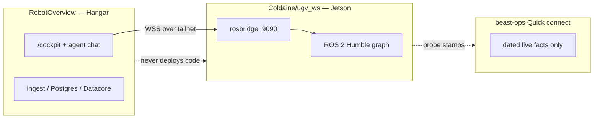
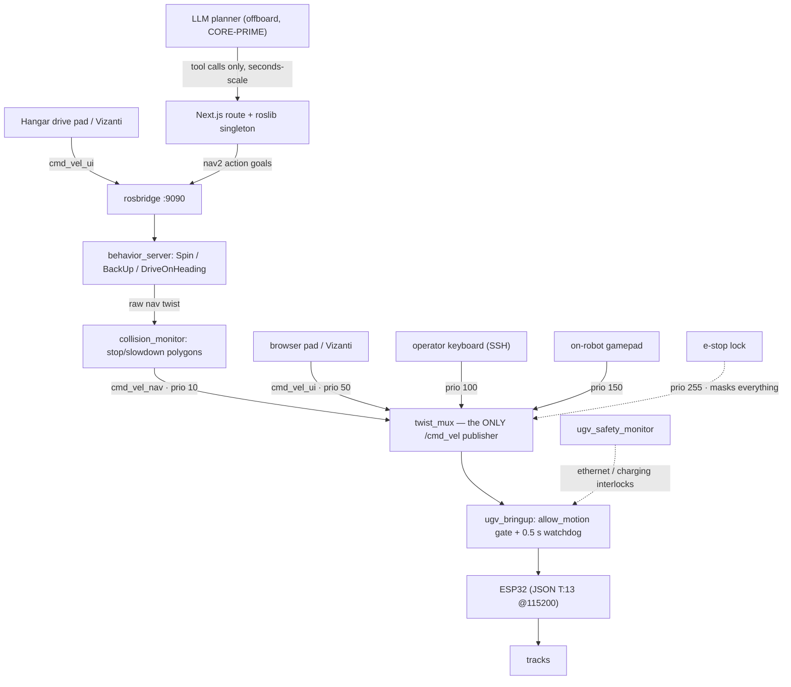
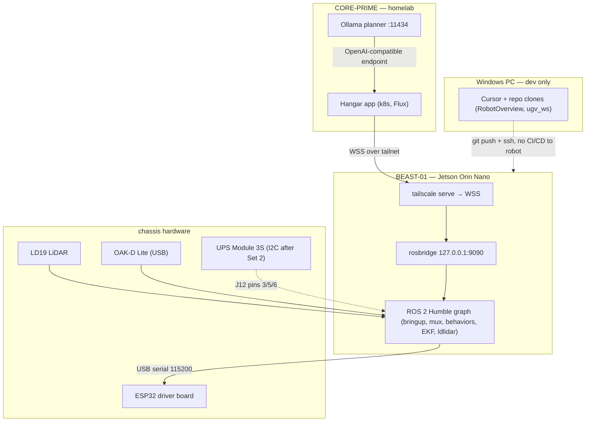
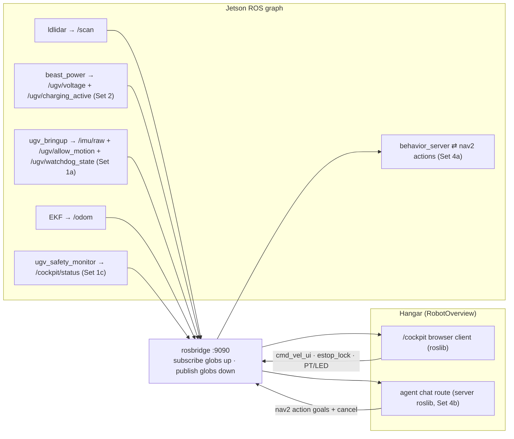

# BEAST control topology

Stable map of how Hangar (this repo) and the robot brain (`ugv_ws`) share authority
over BEAST-01. Architecture decisions live in the
[master plan](plans/2026-08-02-beast-agent-architecture.md). **Volatile live facts**
(SSH paths, pack voltage, boot args, HEAD SHAs, bridge presence) live only in
[`docs/beast-ops.md`](beast-ops.md) Quick connect — re-verify there; do not copy
dated probe numbers into this doc.

## Where the repos live (read this first)

**`ugv_ws` is not inside RobotOverview.** Opening this Hangar folder will never show
the robot brain source tree. Two sibling clones on the Windows PC, one GitHub fork,
one checkout on the Jetson:

| Role | Path / URL |
| --- | --- |
| Hangar (this repo) | `D:\_projects\RobotOverview` → GitHub `Coldaine/RobotOverview` |
| Robot brain — main clone | `D:\_projects\ugv_ws` → GitHub [Coldaine/ugv_ws](https://github.com/Coldaine/ugv_ws) (fork of Waveshare) |
| Robot brain — feature worktrees | `D:\_projects\.worktrees\ugv_ws-*` (e.g. `ugv_ws-pr1-safety`, `ugv_ws-pr4-behaviors`) — same git object DB, different checked-out branches |
| On BEAST-01 | `~/beast/ugv_ws` (same remote; **this** is what actually runs) |
| Hangar cluster manifests | separate repo `coldaine-homelab` — not robot code |

```text
D:\_projects\
  RobotOverview\          ← you are here (Hangar UI / docs / plans)
  ugv_ws\                 ← robot ROS workspace (main checkout)
  .worktrees\
    ugv_ws-pr1-safety\    ← often: beast/pr1-safety-spine
    ugv_ws-pr4-behaviors\ ← often: beast/pr4-agent-behaviors (may match robot HEAD)
    ugv_ws-pr3-lidar\     …
    ugv_ws-pr10\          …
```

List worktrees anytime: `git -C D:\_projects\ugv_ws worktree list`.
**Which branch the robot is on** is a live fact — only Quick connect in
[`docs/beast-ops.md`](beast-ops.md) is authoritative (re-probe with
`git -C ~/beast/ugv_ws rev-parse --short HEAD` + `git branch --show-current`).

Cross-link from the robot side (sibling on disk, not in this git tree):
`D:\_projects\ugv_ws\docs\BEAST.md`.

## Dual-repo map

| Surface | Repo | Owns |
| --- | --- | --- |
| Hangar UI + agent | [RobotOverview](.) (this repo) | `/cockpit`, `/agent`, inventory/wiki, ingest API, Next.js chat + Zod tools, server `roslib` |
| Robot brain | [Coldaine/ugv_ws](https://github.com/Coldaine/ugv_ws) | ROS 2 Humble: bringup, twist_mux, lidar, behaviors, safety monitor, power, rosbridge/systemd |
| Cluster runtime | `coldaine-homelab` | k8s/Flux deploy of Hangar — not robot code |
| Ops ground truth | [`docs/beast-ops.md`](beast-ops.md) | Dated reachability, boot args, voltage, `/scan` proof, bridge state, **robot HEAD** |

Sync path for robot code: edit in `ugv_ws` (or a worktree) → push → pull on Jetson →
`colcon build` → restart named units → prove → dated beast-ops note. Hangar never
deploys to the Jetson
(see [Syncing robot code](beast-ops.md#syncing-robot-code-ugv_ws-to-beast-01)).



## Authority stack

Higher proposes; lower disposes. Every motion source keeps a named twist_mux rung.
The LLM is outer-loop only — four vetoes away from the motors.



Invariant: browser/LLM *propose*; Jetson/ESP32 *dispose* — `allow_motion`, 0.5 s
`cmd_vel_timeout` watchdog, mux priorities, Nav2 collision monitor. A human always
outranks autonomy; someone at the robot outranks everyone; e-stop outranks the
humans; `ugv_bringup` can refuse them all.

Default remains **disarmed** until the Set 1 crawl+kill re-gate passes. Live
`allow_motion` / publisher counts: [beast-ops Quick connect](beast-ops.md#quick-connect-verified-2026-08-02).

## Machine topology



Cockpit bridge (`beast-cockpit.service` / loopback `:9090` + Tailscale Serve WSS) is
Set 1b — presence is a live fact in beast-ops, not assumed here. Stock boot already
brings up the ROS graph via `beast-ros-base.service` (LiDAR on when
`use_lidar:=true`; see Quick connect for current args and `/scan` proof).

## Topic map



Nothing crosses the bridge that is not in a glob. Browser and server share one
bridge; the robot sees topics, not clients. Closed-glob contract:
[Command Deck spec](plans/archived/2026-07-31-beast-command-deck-spec.md).

## What Hangar never does

| Never | Why |
| --- | --- |
| Deploy or `colcon build` on the Jetson | Robot brain is `ugv_ws` only; Hangar is the portal |
| Own safety authority (`allow_motion`, watchdog, mux) | Jetson disposes; Hangar proposes |
| Stream LLM `cmd_vel` or unbounded odom loops | Skills are stock nav2 behaviors with `time_allowance` |
| Bypass rosbridge globs / invent a FastAPI motion API | One bridge; Zod tools + glob allowlist are the intent contract |
| Arm motion from CI, seed data, or offline fixtures | Arming is a supervised on-robot procedure after crawl+kill |
| Treat fixture `src/data/hangar.ts` as live robot state | Facts are Postgres + beast-ops probes |
| Duplicate dated voltage / HEAD / route metrics here | Those drift; Quick connect is the only current-state surface |

## Related

- Intent: [`docs/NORTH_STAR.md`](NORTH_STAR.md) (G7)
- Live ops: [`docs/beast-ops.md`](beast-ops.md)
- Master plan + PR sets: [`docs/plans/2026-08-02-beast-agent-architecture.md`](plans/2026-08-02-beast-agent-architecture.md)
- Immobile session work order: [`docs/plans/2026-08-02-beast-immobile-execution.md`](plans/2026-08-02-beast-immobile-execution.md)
- Advanced cockpit idea bank (not a live plan): Datacore
  [`/datacore/briefing/beast-cockpit-future-roadmap`](/datacore/briefing/beast-cockpit-future-roadmap)
  · thin pointer [`docs/beast-cockpit-future-roadmap.md`](beast-cockpit-future-roadmap.md)
