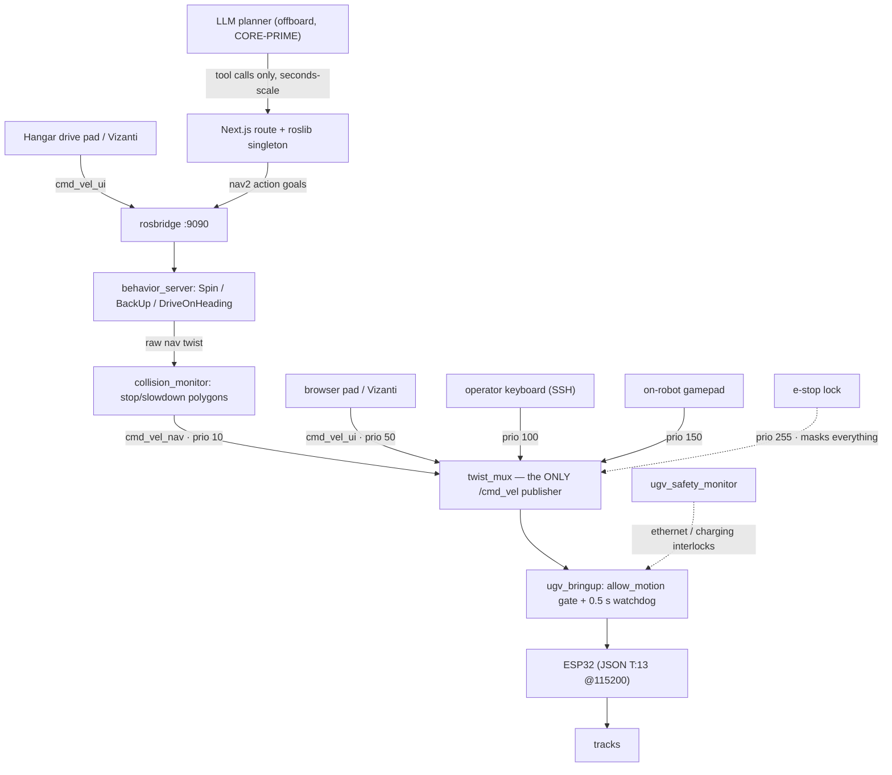
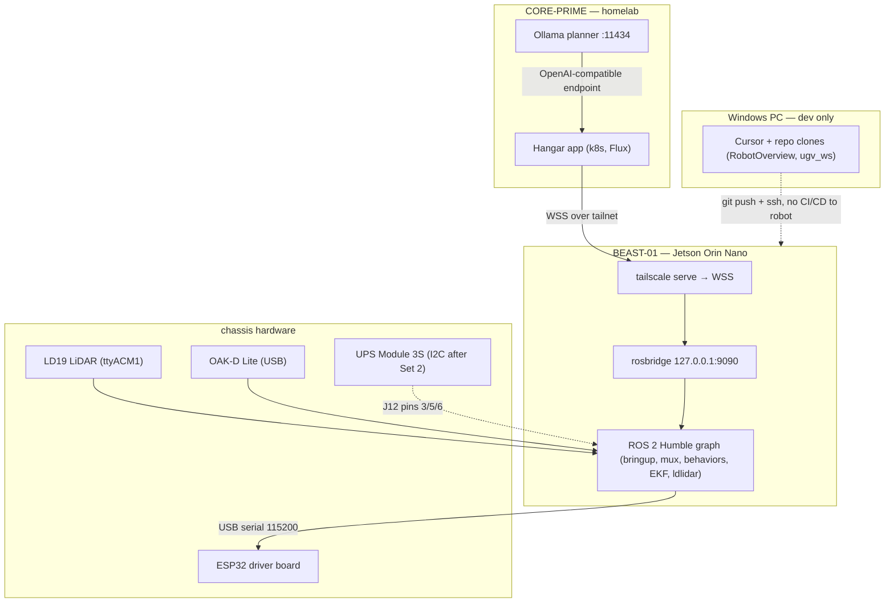
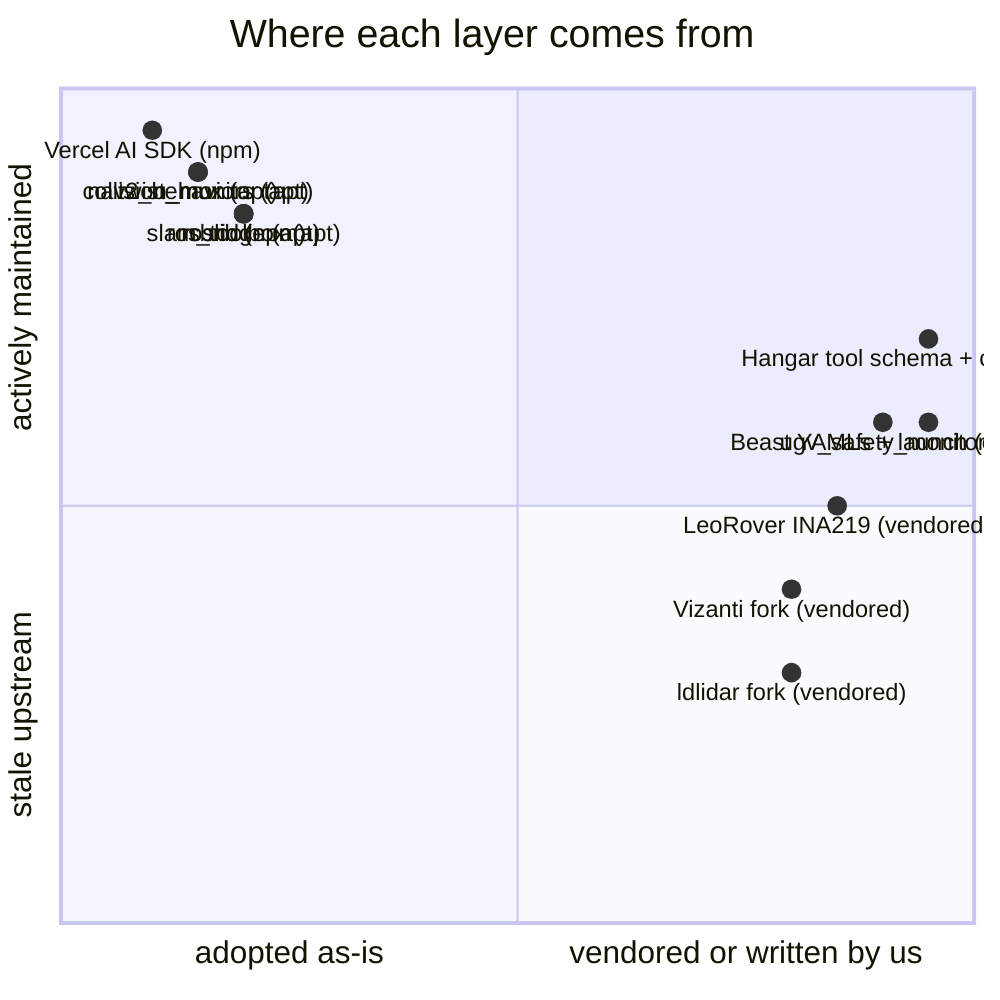
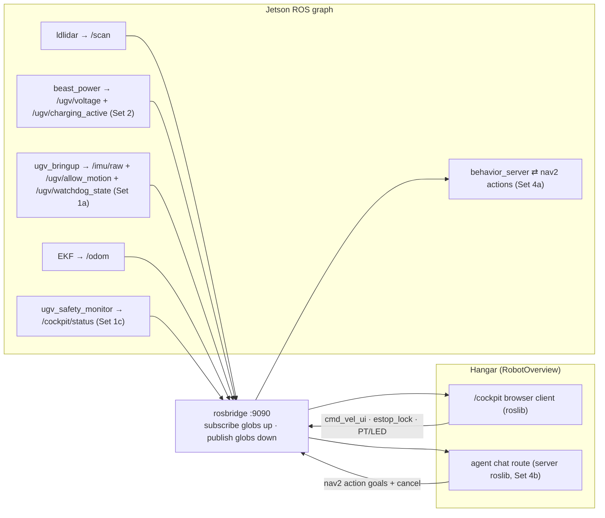
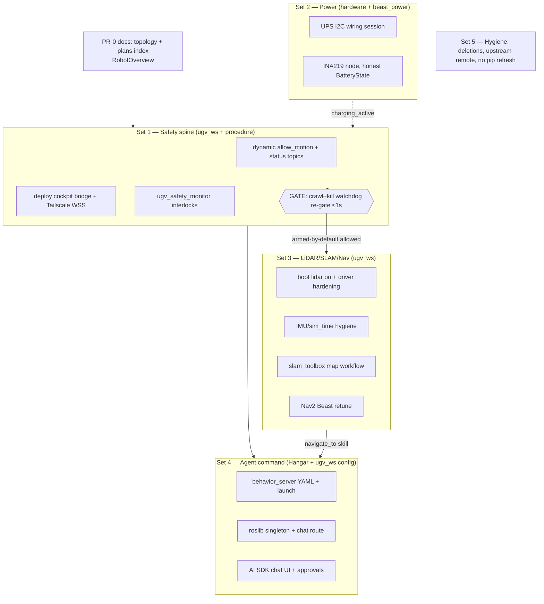
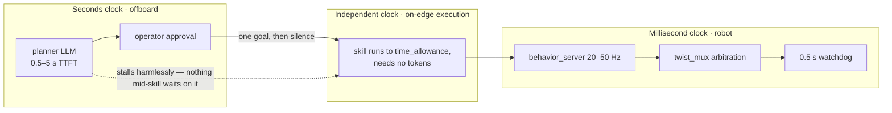

# BEAST-01 Agent Architecture — master plan

**Status:** ACTIVE — 2026-08-02. Consolidates and supersedes the discarded
"robot-architecture-pivot" drafts (safety/lidar/power/llm) and absorbs the remaining
ugv_ws phases of the Command Deck workstream (bridge deploy, SLAM, Nav2 — its
[spec](archived/2026-07-31-beast-command-deck-spec.md) remains the approved cockpit contract).
Ground truth: independent architecture
review (opine agent) and a web-survey of how production robot web UIs transport commands
(roslibjs/rosbridge, Foxglove, Vizanti, rmf-web, Transitive/Freedom, ros-mcp-server).

## The goal

Type natural language in the Hangar and have BEAST-01 act on it — today as discrete
skills, later as waypoint autonomy — with the heavy LLM offboard (CORE-PRIME / cloud)
and the Jetson owning every fast loop. This is North Star G7 made executable. Wi-Fi is
assumed always up; that is an assumption about *latency*, never about *safety*.

## Architecture decisions (locked, evidence-backed)

1. **twist_mux ladder stays; the LLM is outer-loop only.** Every motion source keeps a
   named rung (`ugv_ws/docs/command_arbitration.md`); LLM-originated skills enter at
   `/cmd_vel_nav` (prio 10), outranked by UI/keyboard/gamepad. Opine agent: no behavior
   trees at the velocity layer, no single-owner action server, no zenoh migration now.
2. **Bounded skills, never streamed twists — and we don't write the skills.** Stock
   `ros-humble-nav2-behaviors` provides `Spin`, `BackUp`, `DriveOnHeading` as action
   servers with speed limits, `time_allowance` self-termination, odometry feedback, and
   costmap collision checking — exactly the bounded-skill contract, maintained by Nav2.
   `behavior_server` runs standalone on the `odom` frame (no map, no bt_navigator), so
   it works before SLAM exists. Rejected: pivot-plan token-streaming (`[SPIN_LEFT]`
   until `[STOP_SPIN]`) — a stalled model leaves the robot spinning; the watchdog only
   fires if the *node* dies. Also rejected: porting `behavior_ctrl`'s unbounded odom
   `while` loops anywhere.
3. **Two intent channels, chosen by latency class** (matches industry practice):
   - **Teleop + e-stop: browser → rosbridge WSS direct** (already built as `/cockpit`;
     Vizanti/Foxglove/roslibjs pattern). Tailscale Serve provides WSS — required anyway
     because an HTTPS page cannot open `ws://` (mixed-content).
   - **LLM + mission intents: the Hangar server talks rosbridge too.** A `roslib`
     (npm, maintained, works in Node — not just browsers) singleton in the Next.js
     server sends nav2 behavior action goals over the same deployed bridge. This
     supersedes the earlier "custom FastAPI intent API" idea: no maintained REST→ROS
     bridge exists, and a bespoke one adds a hop, an auth surface, and a process for
     zero capability gain. The intent contract is the Zod tool schema in the Hangar
     route; the robot-side allowlist is rosbridge's `topics_glob`/`services_glob`;
     the motion enforcement below that is `ugv_bringup`'s `allow_motion` gate (a
     disarmed robot simply doesn't actuate, no matter what goals arrive). One
     connection module of glue, no new robot-side service. Server-to-robot runs
     inside the tailnet, so no browser mixed-content constraint applies here.
4. **Command authority may live in the client; safety authority never leaves the robot.**
   The discarded "UI is a stateless viewer" position does not match any production
   teleop system and contradicts G7. The real invariant: browser/LLM *propose*,
   Jetson/ESP32 *dispose* — allow_motion gate, 0.5 s `cmd_vel_timeout` watchdog,
   twist_mux priorities, Nav2 collision monitor.
5. **`allow_motion` becomes a dynamic switch owned by `ugv_bringup`** (dynamic param +
   `SetBool` service + status topics), with a new `ugv_safety_monitor` as a *client*
   enforcing tether/charging interlocks (`ETHERNET_LOCK`, `CHARGING_LOCK`). Default
   stays disarmed until the watchdog re-gate passes — the pivot plan's "armed when
   untethered" only becomes the default after that gate, because the ESP32 heartbeat
   test failed (2026-07-31) and the software watchdog has not passed crawl+kill.
6. **Power telemetry is a standalone `beast_power` package** (INA219 over UPS Module 3S
   I²C) — `ugv_bringup` is already a god-object. True SOC replaces the fake `V/12.6`
   percentage; `charging_active` feeds the safety monitor.
7. **Keep the vendored `ldlidar` fork.** It already carries `bins: 480` and the 225–315°
   crop; upstream `ldlidar_stl_ros2` lacks both (issue #11 open, last push 2024-02).
   The pivot plan's "migrate to upstream" is a confirmed regression. Harden the vendored
   driver instead (`[0, 2π)` publish math, constant-bin assertion).
8. **No bespoke motion executor — but ownership is not authorship.** Verified in
   source: `behavior_ctrl` dispatches via `exec()` and its `drive_on_heading`/`spin`
   skills are unbounded `while` loops keyed to `/odom` — a stalled odom topic means
   the robot drives forever. Both it and `ugv_chat_ai` are retired. Their replacement
   is nav2_behaviors — code we did not write but now **own**: its YAML, its launch
   wiring, its remaps into the mux, its behavior on this chassis, and the tests that
   prove all of it. The reuse rule is *author nothing that exists and fits; own
   everything that runs.* Nothing is sacred.

### Reuse rubric (where to push back on "just use a library")

- **Depend (apt/npm) when** the package is maintained, Humble/Next-native, and
  config-driven: nav2_behaviors, collision_monitor, twist_mux, rosbridge,
  slam_toolbox, Vercel AI SDK, roslib. Pin versions; never fork these.
- **Vendor when** upstream is stale or needs local patches — the existing `ugv_else/`
  pattern: the `ldlidar` fork (patched bins/crop), Vizanti (local teleop remap), the
  LeoRover INA219 node (~176 lines — copy and adapt into `beast_power`; do NOT depend
  on the Galactic-era Pet-Series package).
- **Write when** the logic is site-specific and no library models it: the
  tether/charging interlock, the 3S SOC curve calibration, Beast YAMLs, the Hangar
  tool schema/chat route.
- **Push back (do NOT adopt) even though it "exists":** ROSA's LangChain stack just to
  avoid writing five Zod tools (dependency weight + experimental ChatOllama — only if
  the planner needs live ROS introspection); rmf-web (fleet middleware for one
  robot); rclnodejs (native rcl inside a Next.js deploy — wrong runtime model;
  roslib fits); ros-mcp-server as a product path (no tool allowlisting — dev console
  only); OpenVLA/LeRobot for chat teleop (wrong lane); the full nav2 stack before it
  is needed (behavior_server runs standalone — dragging in bt_navigator/planner/
  controller early is reuse *without* reason).
9. **Deletions, not a dependency refresh.** Remove `ugv_chat_ai`, `ugv_voice`,
   `ugv_web_app`, `cartographer`, `gmapping`, `emcl2`, `explore_lite` (after reference
   check). Vizanti stays as an on-demand ops console. No `pip install -r
   requirements.txt` on the Jetson (numpy/OpenCV pins fight JetPack); add an `upstream`
   remote tracking Waveshare `ros2-humble-develop-251125`.
10. **VLM/closed-loop is a later, offboard lane.** First VLM use is witness/Q&A on
    camera frames from CORE-PRIME. Never on-device TensorRT-LLM in v1, never token-
    streamed motion. OpenVLA/LeRobot belong to a future data-collection lane.

## The authority stack (what can veto what)

Higher in the diagram proposes; lower disposes. Every layer can be overridden by any
layer below its neighbor to the right in the mux, and the bottom three layers do not
know the LLM exists.

A human always outranks autonomy; someone at the robot outranks everyone; the e-stop
outranks the humans; and `ugv_bringup` can refuse them all. The LLM is four vetoes
away from the motors.

## Machine topology (what runs on which box)

## What we adopt vs own (validated against live repos/apt, 2026-08-02)

"Own" = configure, patch, test, and maintain it as ours, regardless of who wrote it.

| Layer | Adopted | How we own it |
| --- | --- | --- |
| Skills | `ros-humble-nav2-behaviors` — standalone `behavior_server`, odom frame, `Spin`/`BackUp`/`DriveOnHeading` actions | our params YAML + launch + remaps + on-robot acceptance |
| Safety clamping | `ros-humble-twist-mux` (locks, already deployed) + `ros-humble-nav2-collision-monitor` (stop/slowdown polygons) | two YAMLs + spine regression tests (existing pattern) |
| Intent transport | `ros-humble-rosbridge-server` (already deployed) + `roslib` npm singleton in the Next.js server | our connection module + glob allowlist config |
| LLM agent + chat UI | Vercel AI SDK — `streamText` + Zod tools in a route handler, `useChat` + built-in tool-approval states; Ollama via its OpenAI-compatible endpoint on CORE-PRIME | our tool schemas, route, and panel — this is the code we write |
| LLM ROS introspection (optional, later) | `jpl-rosa` with `blacklist` — only if the planner needs live graph awareness | blacklist config |
| Power telemetry | `adafruit-circuitpython-ina219` + vendored LeoRover-pattern node in `beast_power` | vendored and adapted — ours to calibrate and test |
| Interlocks | `ugv_safety_monitor` (~100 lines, site-specific: eth0 carrier + charging → `set_allow_motion` client) | written by us — nothing else models it |

Left side: pin the version, never fork. Right side: it is ours to patch, calibrate,
and test. Nothing in the bottom-right should ever be "upgraded" by re-pulling upstream
without reading what our patches do.

**Rejected after validation:** ROS-LLM (stale since 2023-07), ros-mcp-server as a
product transport (no tool allowlisting — keep it as a dev console only), custom
FastAPI ingress (redundant with roslib), any bespoke cmd_vel clamping or motion
primitives.

## Topic map (what data flows where)

Nothing crosses the bridge that is not in a glob. The browser and the server share one
bridge; the robot never distinguishes them — it sees topics, not clients.

## Sequencing ladder

No layer ships before the layer below it passes a live on-robot test. Sets 1, 2, and
the LiDAR halves of 3 can proceed in parallel; motion-bearing work converges on the
re-gate.

## Testing strategy (first-class, not vibes)

Configuration only counts as done when a test proves it. Existing patterns to extend:
`ugv_cockpit/test/test_twist_mux_spine.py` (~988 lines of mux regression tests),
`ugv_bringup/test/` unit tests, `ugv_gazebo` for hardware-free motion, and the
beast-paces on-robot acceptance procedures.

- **Per-PR unit/launch tests** — every ugv_ws PR adds or extends tests (params load,
  remaps resolve, gates flip). Hangar PRs add route/component tests (mocked roslib).
- **Sim e2e lane (new)** — `ugv_gazebo` + real rosbridge + real `behavior_server`:
  exercise the full agent path (chat route → roslib → action goal → cmd_vel through
  the mux) with no hardware. This is where the `behavior_ctrl` bug class gets its
  regression test: stall odom, assert the behavior still terminates on
  `time_allowance`.
- **On-robot acceptance (motion-locked)** — same e2e against the physical robot with
  `allow_motion:=false`: actions run, wheels don't move, watchdog and locks behave.
- **Armed acceptance** — supervised, only after the Set 1 re-gate; beast-paces style,
  results recorded in `docs/beast-ops.md` (dated).

## PR sets (subplans)

| Set | Repo(s) | Subplan |
| --- | --- | --- |
| PR-0 | RobotOverview | This plan + [control-topology doc](../beast-control-topology.md) + plans index |
| Set 1 | ugv_ws + ops | [pr1-safety-spine](2026-08-02-beast-agent-pr1-safety-spine.md) |
| Set 2 | ugv_ws + bench | [pr2-power-telemetry](2026-08-02-beast-agent-pr2-power-telemetry.md) |
| Set 3 | ugv_ws | [pr3-lidar-slam-nav](2026-08-02-beast-agent-pr3-lidar-slam-nav.md) |
| Set 4 | ugv_ws + RobotOverview | [pr4-agent-command](2026-08-02-beast-agent-pr4-agent-command.md) |
| Set 5 | ugv_ws | [pr5-hygiene](2026-08-02-beast-agent-pr5-hygiene.md) |

## Latency budget (design targets, from the wifi-tail rule: the tail, not the median)

| Segment | Typical | Design for |
| --- | --- | --- |
| Wi-Fi RTT (LAN 5 GHz) | 2–10 ms | 50–200 ms stalls, rare 500 ms |
| LLM TTFT (8B homelab / large remote) | 0.1–1.5 s | 0.5–5 s |
| Intent → skill accept | 10–50 ms | 100 ms |
| Skill execution | wall-clock bounded on edge | independent of LLM after start |
| Teleop override through mux | <1 tick | must always beat autonomy |
| `cmd_vel` watchdog stop | 0.5 s silence | keep |

LLM is the seconds-scale outer loop. After a skill starts, motion requires no further
LLM round-trip until the next command; cancel is the exception and must be fast.

## The three clocks (why the LLM never endangers the loop)

Three independent clocks share no dependency: a frozen planner freezes nothing, a
dropped Wi-Fi stall changes nothing mid-skill, and the reflex layers keep their own
time regardless.

## Non-goals (v1)

- LLM publishing continuous `cmd_vel`, or unrestricted ROSA/MCP/ros2ai publish on the
  live chassis (MCP allowed in a lab profile with `allow_motion:=false`).
- Free-form code execution from model output (the `exec()` anti-pattern being retired).
- VLA closed-loop piloting, on-device VLM, Nav2 goals before the re-gate.
- Browser gamepad transport, TF/map rendering in the Hangar, click-to-nav goals, 3D
  point-cloud optics, LiDAR decay trails — out of scope for *this* workstream’s v1.
  Those advanced cockpit ideas are preserved as Datacore briefing
  [`beast-cockpit-future-roadmap`](/datacore/briefing/beast-cockpit-future-roadmap)
  (thin repo pointer: [`docs/beast-cockpit-future-roadmap.md`](../beast-cockpit-future-roadmap.md)),
  not as non-goals content.

## Success criteria

- Stock boot publishes trusted 480-bin `/scan`; cockpit SpatialView and Vizanti light up.
- `/ugv/voltage` carries honest SOC and `charging_active`; plugging the charger or
  Ethernet locks motion with a visible reason code.
- Operator types a command in the Hangar → confirmed intent → robot executes a bounded
  skill on `/cmd_vel_nav`; keyboard/gamepad/UI still override; silence still stops.
- The tree no longer contains `exec()`-dispatched motion or unbounded odom loops.
