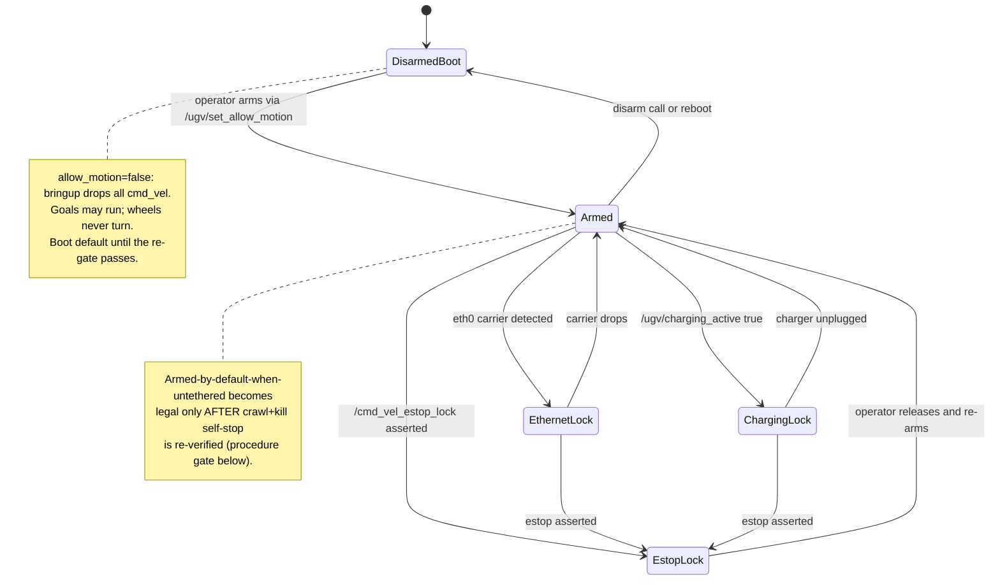

# Set 1 — Safety spine (ugv_ws + ops)

**Parent:** [master plan](2026-08-02-beast-agent-architecture.md).
**Why first:** every later set assumes a robot that stops when told and a bridge the
Hangar can actually reach. Most of this exists in-tree but is undeployed or static.

## Inputs

- `ugv_ws/src/ugv_main/ugv_bringup/ugv_bringup/ugv_bringup.py` — `allow_motion` launch
  arg today; `cmd_vel_timeout` 0.5 s watchdog already deployed (2026-07-31).
- `ugv_ws/src/ugv_main/ugv_cockpit/` — twist_mux spine + rosbridge launch; branch
  `feat/cockpit-bridge` (ugv_ws PR #10) adds `/cockpit/status`, `/ugv/allow_motion`,
  `/ugv/watchdog_state`.
- Command Deck [spec](../plans/archived/2026-07-31-beast-command-deck-spec.md) §closed topic
  globs; `.claude/skills/beast-paces` Phase 2 crawl+kill procedure.
- `docs/beast-ops.md` Quick connect — ESP32 heartbeat test FAILED (2026-07-31).

## Work items

### PR-1a — Dynamic `allow_motion` (ugv_ws)
- Convert `allow_motion` to a dynamically settable parameter in `ugv_bringup`; on
  transition to `false`, send a stop immediately (do not wait for watchdog).
- Add `SetBool` service `/ugv/set_allow_motion` and latched publishers
  `/ugv/allow_motion` (Bool) + `/ugv/watchdog_state` (DiagnosticStatus) — matching the
  PR #10 contract the Hangar already subscribes to.
- Unit tests: gate flips, stop-on-disable, watchdog fires under silence.

### PR-1b — Deploy the cockpit bridge (ugv_ws + ops)
- Land ugv_ws PR #10 (review feedback resolved on `feat/cockpit-bridge`), then install
  `beast-cockpit.service` on the robot (disabled by default in repo; enable after
  commissioning).
- rosbridge stays loopback `:9090`; expose via Tailscale Serve as WSS (this also fixes
  the HTTPS-page → `ws://` mixed-content block for the deployed Hangar).
- Commissioning with motion locked: publish rejected outside the exact globs; no
  services/actions through the bridge. Update `docs/beast-ops.md` (dated).

### PR-1c — `ugv_safety_monitor` node (ugv_ws)
- New lightweight node (in `ugv_cockpit` or its own package) that is a **client** of
  `/ugv/set_allow_motion`, never a second authority.
- Ethernet carrier: poll `/sys/class/net/<iface>/carrier`; carrier up →
  `ETHERNET_LOCK`.
- Charging: subscribe `beast_power`'s `charging_active` when Set 2 exists; absent
  topic → no lock (fail-open here is fine; default disarmed is the real guard).
- Publish reason codes on `/cockpit/status`-compatible diagnostics so the Hangar safety
  strip can render the lock reason verbatim.
- SSH override: `/ugv/safety/override` service, logged, latching until reboot.

### The motion state machine

### Procedure gate (no PR) — watchdog re-gate
- beast-paces Phase 2: supervised crawl + kill publisher; self-stop ≤ 1 s; record
  pass/fail + stop delay in `docs/beast-ops.md`.
- **Only after pass:** `ugv_safety_monitor` may default to armed-when-untethered, and
  Sets 3e/4 motion work may arm for supervised sessions.

## Done when

- Bridge live on Tailscale WSS; Hangar cockpit shows real telemetry with motion locked.
- `ros2 param` / service can flip motion authority at runtime with immediate stop.
- Tether lock demonstrable: plug Ethernet while armed → motion locks, UI shows
  `ETHERNET_LOCK`; unplug → re-arms (post-gate).
- Re-gate result recorded; if failed, everything downstream stays locked.
