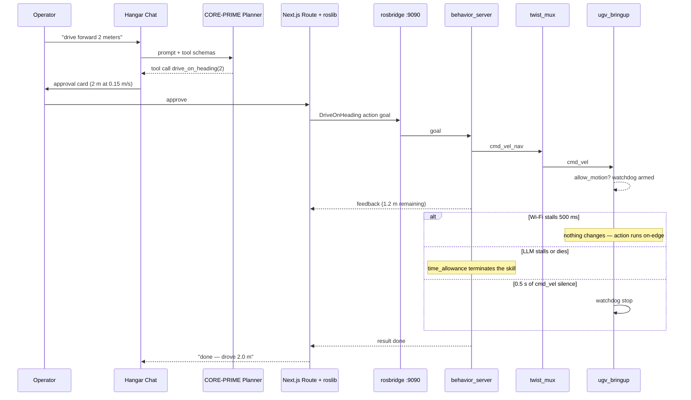
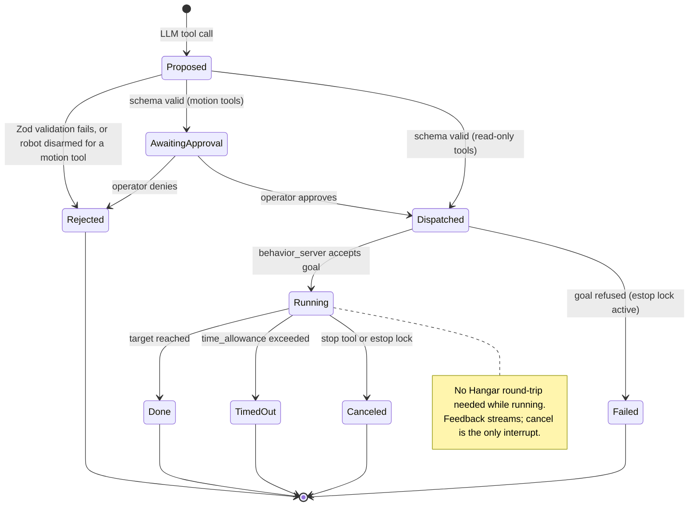

# Set 4 — Agent command path (RobotOverview + ugv_ws config)

**Parent:** [master plan](2026-08-02-beast-agent-architecture.md). The headline feature:
type language in the Hangar, robot acts. We author little; we own plenty. Stock nav2
behavior actions execute, rosbridge/roslib transports, Vercel AI SDK runs chat and
tool-calling — and our job is to configure it to actually run correctly on this
chassis and prove it with end-to-end tests (see the master's testing strategy).

## Why the old robot-side code dies (verified in source)

`ugv_tools/behavior_ctrl.py` dispatches model output with `exec()` and its
`drive_on_heading`/`spin`/`back_up` skills are unbounded `while` loops keyed to `/odom`
— a stalled odom topic means the robot drives forever, and only the 0.5 s watchdog
limits the damage. `ugv_chat_ai` (Flask `:5000` → Ollama) is built on both. Neither is
ported; nav2's own behaviors replace them wholesale (Set 5 deletes the packages).

## What we deliberately do NOT write

| Instead of… | We adopt… |
| --- | --- |
| Custom `beast_agent` skill executor | `ros-humble-nav2-behaviors` — `Spin`, `BackUp`, `DriveOnHeading` action servers; `time_allowance` self-termination, speed limits, odometry feedback, costmap collision checking. Bounded by construction. |
| Custom FastAPI intent API | `roslib` (npm 2.x, maintained) singleton in the Next.js server → the already-deployed rosbridge. No REST bridge exists worth using; none needed. |
| Custom cmd_vel clamping | `ros-humble-nav2-collision-monitor` (stop/slowdown polygons) + twist_mux locks — stock. |
| Hand-rolled chat/tool UI | Vercel AI SDK: `streamText` + Zod `tool()` definitions, `useChat` with built-in tool-approval states = human-in-the-loop confirm for free. |
| ROS-LLM / ros-mcp-server | Skipped (stale / no allowlist). ROSA (`jpl-rosa`) stays an optional later add for ROS introspection tools, with its `blacklist`. |

## Work items

### The command trace (one typed sentence, end to end)

Three independent failure paths, three independent answers — none of them is "the
robot keeps doing something unpredictable."

### PR-4a — behavior_server on the robot (ugv_ws — config only)
- Install `ros-humble-nav2-behaviors`; add a launch include + params YAML (new small
  config-only package or a section of `ugv_cockpit` — pick one, document it):
  - `global_frame: odom`, `local_frame: odom` — no map, no bt_navigator/planner.
  - Remap behavior cmd_vel output into the mux's `/cmd_vel_nav` input (prio 10).
  - Beast speeds: ≤ 0.15 m/s, `simulate_ahead_time` per Nav2 defaults to start.
- Collision assistance needs a costmap: run a minimal standalone `nav2_costmap_2d` fed
  by `/scan` (requires Set 3a), or explicitly accept blind primitives in v1 with a
  code comment and a follow-up ticket. Decide once; don't silently half-wire it.
- **Enforcement note:** nav2 behaviors don't know about `allow_motion` — they don't
  need to. `ugv_bringup` drops actuation when disarmed, so a goal sent while locked
  burns compute, not rubber. The Hangar also checks `/ugv/allow_motion` before
  dispatching (UX-level honesty).
- Verify: `ros2 action list` shows `/spin`, `/backup`, `/drive_on_heading`; a
  disarmed `spin 90°` goal completes its loop without wheel motion.

### PR-4b — Hangar agent server route (RobotOverview)
- `src/server/beast/ros-singleton.ts` (name flexible): one `roslib` `ROS.Ros`
  WebSocket client to the robot bridge (`BEAST_COCKPIT_WS_URL`, same bridge the
  browser uses), reconnect + status surfacing. Server-side, so no browser
  mixed-content issue; tailnet is the network boundary.
- `/api/agent/chat` route handler: `streamText` with tools, one per skill,
  Zod schemas mirroring the nav2 action goals 1:1:
  `drive_on_heading {meters, speed?}`, `spin {degrees}`, `back_up {meters}`,
  `stop {}` (cancel active goals), `get_status {}` (allow_motion, watchdog, voltage,
  scan-alive — read via the same roslib client).
- Tool `execute` sends the action goal and streams feedback/result; `stop` cancels.
- Motion tools require approval (AI SDK tool-approval flow) until the schema is
  proven; `get_status`/`stop` never require approval.
- Planner: OpenAI-compatible provider → Ollama on CORE-PRIME (`http://…:11434/v1`),
  model chosen by env var. Guided/structured output where the endpoint supports it.

### PR-4c — Hangar agent chat UI (RobotOverview)
- Agent panel sibling to the `/cockpit` drive surface: `useChat` +
  `DefaultChatTransport`; render tool parts with their approval states; approve/deny
  for motion intents; live status line (running skill, feedback distance/angle
  remaining, timeout/cancel results).
- Honesty: disarmed robot → motion tools visibly gated with the lock reason from
  `/cockpit/status`; the LLM is told via system prompt to check `get_status` first.

### PR-4d — Later slices (same set, separate PRs)
- `navigate_to` tool after Set 3e (Nav2 `NavigateToPose` via the same roslib client).
- Optional ROSA add: introspection tools for the planner (`blacklist` everything that
  publishes; keep list/echo/params) — only if the planner demonstrably needs live
  graph awareness beyond `get_status`. Do not adopt it just to avoid writing five
  Zod tools; LangChain + experimental ChatOllama is real dependency weight.
- MCP dev-console profile: ros-mcp-server pointed at the robot for Cursor-side poking,
  `allow_motion:=false`; never the product path.
- VLM witness lane: planner may request an OAK JPEG frame for grounding/Q&A
  (offboard only).

### PR-4e — End-to-end test harness (both repos)
- **Sim lane:** `ugv_gazebo` + real rosbridge + real `behavior_server`; a scripted
  driver (or the Hangar route against a test bridge) sends goals and asserts: cmd_vel
  flows only through the mux nav rung, `time_allowance` terminates behaviors, and —
  the `behavior_ctrl` regression — a stalled odom topic still ends the run.
- **Hangar side:** route-handler tests with mocked roslib (schema validation,
  approval gating, cancel path, disarmed-robot honesty).
- **On-robot acceptance (motion-locked):** same goal set against the physical robot
  with `allow_motion:=false` — actions execute, wheels stay still, watchdog/locks
  verified. Armed supervised runs follow only after the Set 1 re-gate, recorded in
  `docs/beast-ops.md`.

## The intent lifecycle

This diagram doubles as the PR-4e acceptance-test checklist: every transition gets a
test in the sim lane, and every terminal state gets a UI rendering.

## Done when

- Typed command → tool call → approval → nav2 behavior executes on `/cmd_vel_nav`;
  teleop override intact; killing the LLM mid-skill changes nothing (the action
  finishes or times out on its own `time_allowance`).
- The sim e2e lane passes in CI or on-demand, including the stalled-odom regression;
  motion-locked on-robot acceptance passes before any armed run.
- Behavior goals terminate on their own without any Hangar round-trip — the
  `behavior_ctrl` bug class (unbounded odom loops) cannot recur because that code is
  deleted and the replacement is Nav2's.
- Total new runtime code we authored: one roslib module, one chat route, one chat
  panel, plus YAMLs, launch files, and the tests that own all of it.
