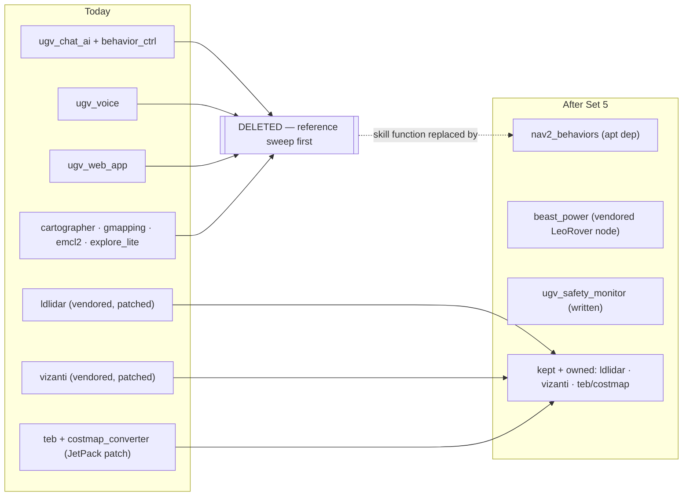

# Set 5 — Hygiene: deletions and dependency discipline (ugv_ws)

**Parent:** [master plan](2026-08-02-beast-agent-architecture.md). Cheap, parallel, and
it keeps every other set's diffs small. Nothing here changes robot behavior.

## The tree migration (before → after)

## Deletions (PR-5a, after a reference sweep)

Delete from `ugv_ws` (search launch files, `setup.py` entry points, systemd units, and
docs first; keep whatever still has a live caller):

| Target | Why |
| --- | --- |
| `ugv_main/ugv_chat_ai` | Retired by Set 4's `beast_agent` |
| `ugv_main/ugv_voice` | KWS/ASR/TTS demo surface; no command role |
| `ugv_main/ugv_web_app` | Thin Vizanti wrapper; Vizanti can be launched directly |
| `ugv_else/cartographer`, `ugv_else/gmapping` | Dead SLAM alternates; slam_toolbox is the path |
| `ugv_else/emcl2_ros2` | Unused localization alternate |
| `ugv_else/explore_lite` | Stale vs upstream rewrite; frontier explore is out of scope |
| `behavior_ctrl` entry points in `ugv_tools` | `exec()` + unbounded loops; superseded by `beast_agent` |

Keep: vendored `ldlidar` (patched fork — do not "upgrade" to upstream), `vizanti`
(on-demand ops console), `rf2o`, `teb_local_planner` + `costmap_converter`
(JetPack OpenCV patch — never re-vendor from upstream ROS).

## Dependency discipline (PR-5b)

- **No** `pip install -r requirements.txt` on the Jetson — its numpy/OpenCV/depthai pins
  fight JetPack system packages; treat the file as Pi/VM AI-kit pins, not robot truth
  (say so at the top of the file).
- Add `upstream` remote → `waveshareteam/ugv_ws`, fetch, and track
  `ros2-humble-develop-251125` so the ~6-commit vendor gap is visible without guessing.
- Waveshare's newer `Behavior.action` progress fields are **not** needed: Set 4 uses
  stock nav2 behavior actions, not the Waveshare chat/action stack.
- Python deps for the new `beast_power` node (`adafruit-circuitpython-ina219` /
  `smbus2`) get declared with that package — not piled into the root file.
- Apt ROS packages (`ros-humble-*`) stay on Humble; bump opportunistically during robot
  sessions, never as a drive-by.

## Done when

- Workspace builds with the deleted packages gone; `ros2 pkg list` matches the table.
- `git remote -v` shows `upstream`; `requirements.txt` carries the not-for-Jetson
  header; new-package deps declared per-package.
