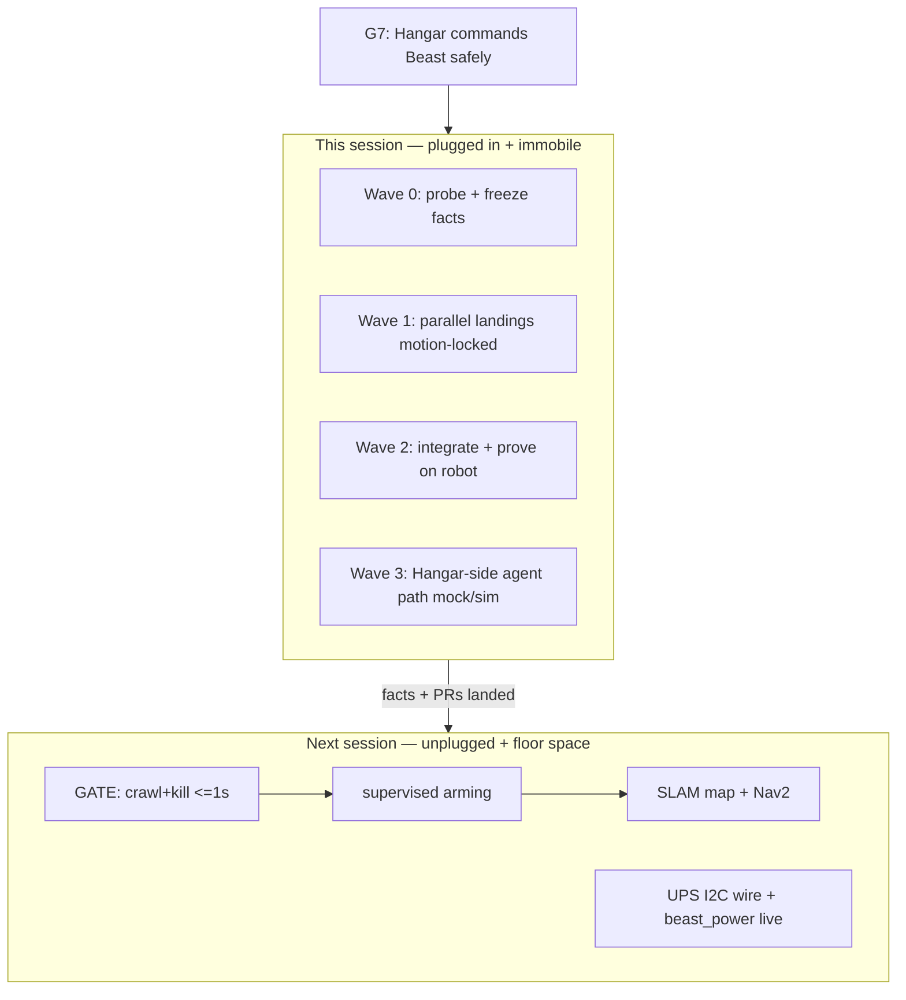

# BEAST immobile-session execution + test plan

**Parent:** [master plan](2026-08-02-beast-agent-architecture.md).
**Subplans:** [safety spine](2026-08-02-beast-agent-pr1-safety-spine.md) · [power](2026-08-02-beast-agent-pr2-power-telemetry.md) · [lidar/slam/nav](2026-08-02-beast-agent-pr3-lidar-slam-nav.md) · [agent command](2026-08-02-beast-agent-pr4-agent-command.md) · [hygiene](2026-08-02-beast-agent-pr5-hygiene.md).
**Why now:** advance the accepted beast-agent ladder under the current physical
constraint — robot powered, plugged in, immobile — without inventing a new
architecture.

A plan here is a work order for agents that were not present when it was written:
inputs, waves, gates, emitables, and pass/fail. It does not govern the code.

## Session status (closed 2026-08-02 Wave 3)

Immobile session complete under hard bans (never `allow_motion:=true`; no crawl+kill; no UPS wiring; voltage ~10.4 V - do not arm).

| # | Criterion | Must pass? | Result |
| --- | --- | --- | --- |
| 1 | Ground-truth Quick connect updated (dated) | Yes | **YES** - Wave 3 stamp in `docs/beast-ops.md` |
| 2 | `/scan` at stock boot, 480 bins | Yes | **YES** - Wave 0/2 + close re-check |
| 3 | Dynamic `allow_motion` + status topics; default false | Yes | **YES** - `/ugv/allow_motion` false; `/ugv/safety/status` ETHERNET_LOCK |
| 4 | Cockpit bridge reachable or blocked with reason | Yes | **BLOCKED** - `beast-cockpit` disabled/inactive; Tailscale Serve = No serve config; Hangar pad not opened |
| 5 | Hangar agent mocked tests; live `get_status` | Yes (partial OK) | **PARTIAL** - agent vitest mocked pass; live Hangar `get_status` blocked on Serve; SSH proved Hangar topics |
| 6 | nav2 behavior_server launchable; disarmed goal | Yes | **YES** - `ugv_cockpit` @ `2d1eab7`; actions present; disarmed Spin/DriveOnHeading ABORTED; allow_motion false; process stopped after proof |
| 7 | Watchdog crawl+kill | No | **DEFERRED** |
| 8 | UPS I2C / true SOC | No | **DEFERRED** |
| 9 | Typed NL -> approved skill -> actual drive | No | **DEFERRED** |

**Robot HEAD:** `2d1eab7` `beast/pr4-agent-behaviors` (on `bebb86e` safety+lidar). **Hangar:** `/agent` behind `HANGAR_AGENT_ENABLED`; live bridge smoke deferred.

**Deferred next session (explicit):** crawl+kill; armed-by-default; UPS I2C; SLAM/Nav2; navigate_to armed demo; Set 5 deletions on robot.

### Packaging status (updated when PRs open)

| Artifact | Repo | Branch | PR |
| --- | --- | --- | --- |
| Hangar plans, topology, `/agent`, beast-ops, commit-and-PR rule | RobotOverview | `feat/beast-immobile-agent-session` @ `1c7b75b` | https://github.com/Coldaine/RobotOverview/pull/152 |
| Safety spine + lidar hygiene (on robot lineage) | ugv_ws | `beast/pr1-safety-spine` @ `bebb86e` | https://github.com/Coldaine/ugv_ws/pull/11 |
| behavior_server (on robot @ `2d1eab7`) | ugv_ws | `beast/pr4-agent-behaviors` | https://github.com/Coldaine/ugv_ws/pull/12 (into pr1) |
| `beast_power` offline scaffold | ugv_ws | `beast/power-telemetry-on-cockpit` (prefer) / `beast/power-telemetry` | https://github.com/Coldaine/ugv_ws/pull/14 (Beast line); https://github.com/Coldaine/ugv_ws/pull/13 (develop sibling) |

**Master-plan progress (honest):** immobile session scorecard above ≠ Sets 1–5 complete.
Roughly: Set 1a/1c + lidar boot/hygiene + Set 4a on robot; Hangar Set 4b/4c scaffold;
Set 2 software only; Serve/WSS, UPS wire, crawl+kill, SLAM/Nav2, Set 5 still open.

## Overall goals (do not lose these)

From [docs/NORTH_STAR.md](../NORTH_STAR.md) G7 and the master plan:

1. Hangar is the live command portal (teleop + NL agent).
2. Safety authority stays on the robot (`allow_motion`, 0.5 s watchdog, twist_mux).
3. LLM is outer-loop only; skills are stock nav2 behaviors.
4. Own what runs (configure/vendor/test); author only what nothing else models.
5. Configuration is done only when a test proves it.

## Current physical constraint (locked for this session)

Operator-stated: robot is **activated, plugged in, immobile**. Combined with
[docs/beast-ops.md](../beast-ops.md) Quick connect (2026-08-02):

- Prefer Wi-Fi or Tailscale SSH; Ethernet may be the preferred route metric when
  cable is connected — that is itself a Set 1c interlock signal later.
- Boot service is expected to keep `allow_motion:=false`.
- **Hard bans this session:** arm `allow_motion:=true`, crawl+kill re-gate,
  supervised mapping drives, Nav2 goals that assume armed motion, UPS Module 3S
  I²C rewiring while powered (Set 2 hardware bench).

## Session defaults (no further questions)

- **Reachability:** probe all documented paths first (`beast-01`, `.187`,
  `beast-01-ts`, Ethernet `.166` if cable present).
- **Scope:** software/config/tests + boot `use_lidar:=true` with `/scan` proof.
  No arming. No UPS pin work.
- **Repos:** Hangar = RobotOverview PRs; robot brain = `Coldaine/ugv_ws` PRs;
  ops facts = dated `docs/beast-ops.md` updates only after live proof.

## Inputs

- [docs/NORTH_STAR.md](../NORTH_STAR.md) G7.
- [docs/plans/2026-08-02-beast-agent-architecture.md](2026-08-02-beast-agent-architecture.md)
  and Sets 1–5 subplans above.
- [docs/beast-ops.md](../beast-ops.md) Quick connect — ground-truth surface;
  update only after live proof.
- Local `ugv_ws` at `D:\_projects\ugv_ws` (compare HEAD to robot `~/beast/ugv_ws`).
- Hangar repo surfaces for Set 4 stubs and PR-0 topology doc.

## Wave 0 — Ground truth (serial, ~15 min, blocks everything)

One shell agent. Record outputs into Quick connect (dated).

1. SSH probe matrix + `uptime`, pack voltage, link in use (Wi-Fi vs Ethernet).
2. `systemctl is-active beast-ros-base.service`; `systemctl cat` for exact launch args.
3. Confirm `allow_motion` is false; `/cmd_vel` publisher count; `/ugv/voltage` once.
4. Confirm LiDAR by-id device exists; note whether `use_lidar` is still false.
5. `git -C ~/beast/ugv_ws rev-parse --short HEAD` + branch; compare to local
   `D:\_projects\ugv_ws`.
6. Capture whether `beast-cockpit.service` / rosbridge `:9090` exist yet.

**Gate A:** robot reachable, motion locked, voltage > ~10.5 V (or charge
progressing). If unreachable, stop — no speculative robot claims.

**Done when:** dated Quick connect block reflects probe outputs; Gate A pass/fail
is explicit.

## Wave 1 — Parallel landings (motion-locked only)

Launch **four parallel subagents** after Gate A. Each owns one repo surface; none
may request arming.

| Agent | Set | Deliverable | Test before merge |
| --- | --- | --- | --- |
| A — Docs/PR-0 | RobotOverview | Write [docs/beast-control-topology.md](../beast-control-topology.md) from master-plan diagrams; fix Quick-connect LiDAR contradiction only after Wave 2 proves lidar | `task check` / lint on touched docs if required by repo |
| B — Safety spine code | ugv_ws Set 1a+1c (code only) | Dynamic `allow_motion` param/service/status topics; `ugv_safety_monitor` client (Ethernet carrier + stub/absent charging); keep default disarmed | unit tests in package; no live arm |
| C — LiDAR boot + hygiene | ugv_ws Set 3a–3c | `use_lidar:=true` in `beast-ros-base.service`; by-id port in env example; `[0,2π)` / bins harden; IMU/sim_time hygiene patches | build selected packages; motion stays false |
| D — Agent path Hangar stubs | RobotOverview Set 4b/4c skeleton | `roslib` server singleton module + AI SDK chat route/UI behind env flags; tools call **mocked** rosbridge in unit tests | vitest for schema/approval/disarmed honesty |

**Parallel constraint:** Agents B/C must not restart services that fight each
other; Wave 2 owns on-robot apply order.

Set 5 hygiene (deletions) runs as a **fifth parallel agent only for reference
sweep + draft PR**, not for deleting packages on the live robot until Sets 1/4
replacements build.

Set 2 software (`beast_power` vendored node + fake-bus tests) may run as a sixth
parallel agent **offline only** — no I²C attach this session.

**Done when:** each agent's PR (or draft) names the G7/master-plan decision it
advances; tests listed above are green; no agent has armed motion.

## Wave 2 — On-robot integrate + prove (serial apply order)

One shell/robot agent. Order matters:

1. Sync/build Set 1a (`ugv_bringup` dynamic gate) → restart `beast-ros-base` →
   prove `/ugv/allow_motion` publishes false; service flip to true is refused or
   accepted **without** enabling chassis motion if still software-gated — prefer
   testing the param path while keeping motors inert (watchdog + false default).
2. Apply Set 3a lidar boot (`use_lidar:=true`, by-id) → restart → prove `/scan`
   ~10 Hz and `len(ranges)==480` twice; TF `base_link→base_lidar_link`.
3. Deploy cockpit bridge if PR-ready (Set 1b): install service disabled-by-default,
   commission loopback `:9090`, Tailscale Serve WSS only after globs verified;
   Hangar cockpit telemetry smoke (motion pad must stay disabled).
4. Ethernet interlock demo if cable present: carrier → lock reason on
   `/cockpit/status` (or diagnostics) without ever needing wheels.
5. Date-stamp Quick connect with HEAD, scan proof, bridge state.

**Gate B (session success minimum):** `/scan` live at boot, motion still locked,
Hangar can see telemetry if bridge deployed, docs contradiction fixed from live
facts.

**Done when:** Gate B criteria met or each failure has an explicit blocker note in
Quick connect.

## Wave 3 — Agent path without rubber (sim + motion-locked)

Parallel:

| Agent | Work | Pass criteria |
| --- | --- | --- |
| E — ugv_ws Set 4a | Install `ros-humble-nav2-behaviors`; launch/params remapping to `/cmd_vel_nav`; build | `ros2 action list` shows spin/backup/drive_on_heading |
| F — e2e harness | Gazebo or motion-locked on-robot: send DriveOnHeading while `allow_motion:=false` | action runs; wheels do not move; `time_allowance` terminates; stalled-odom regression if sim available |
| G — Hangar agent | Point chat tools at live bridge **only** for `get_status` / cancel; motion tools require approval and must no-op or refuse when disarmed | vitest + one live disarmed smoke |

Do **not** install a product FastAPI intent API. Do **not** enable MCP as a motion
path.

**Done when:** scorecard rows 5–6 are Yes, PR-ready, or explicitly blocked with
reason.

## Explicitly deferred (next session checklist)

Write this list into the session close note in beast-ops / master plan status:

- Set 1 procedure gate: crawl+kill ≤ 1 s (needs floor + unplugged)
- Armed-by-default-when-untethered
- Set 2 UPS I²C pin work + live INA219 charging_active
- Set 3d/3e mapping + Nav2 retune
- Set 4 `navigate_to` + any armed skill demo
- Set 5 package deletions on the robot after replacements are proven

## Parallel subagent operating rules

- Each agent gets a single Set/PR boundary and a **written "done when"** from the
  existing subplan.
- No agent may set `allow_motion:=true` or edit systemd to that effect.
- Robot mutations go through: local commit → push → pull on Jetson →
  `colcon build` of selected packages → restart named units → prove → dated
  beast-ops note.
- Conflicts: safety spine (B) wins over lidar (C) if both touch bringup launch;
  rebase C onto B before Wave 2.
- Keep overall goals visible: every PR description must name which G7/master-plan
  decision it advances.

## Session exit criteria (scorecard)

| # | Criterion | Must pass this session? |
| --- | --- | --- |
| 1 | Ground-truth Quick connect updated (dated) | Yes |
| 2 | `/scan` at stock boot, 480 bins | Yes |
| 3 | Dynamic `allow_motion` + status topics exist; default false | Yes (code + motion-locked proof) |
| 4 | Cockpit bridge reachable or explicitly blocked with reason | Yes |
| 5 | Hangar agent route exists with mocked tests; live `get_status` smoke | Yes (partial OK) |
| 6 | nav2 behavior_server launchable; disarmed goal does not spin tracks | Yes if apt/build time allows; else PR ready |
| 7 | Watchdog crawl+kill | No — deferred |
| 8 | UPS I²C / true SOC | No — code offline only |
| 9 | Typed NL → approved skill → actual drive | No — deferred |

## Artifacts to emit

1. This work order (durable in-repo) — linked from [docs/plans/README.md](README.md).
2. PRs on `ugv_ws` and RobotOverview as Wave 1/2/3 land.
3. Dated beast-ops Quick connect update after Gate B.
4. Session close note: scorecard + deferred next-session checklist.

## Failure modes

- **Brownout / SSH loss:** stop; charge; do not leave `allow_motion` experiments
  mid-air.
- **LiDAR port wrong:** revert systemd to `use_lidar:=false` before ending session.
- **Bridge open too wide:** keep services/actions off; revert Tailscale Serve if
  globs fail.
